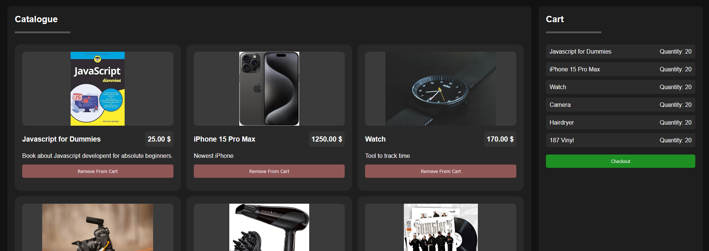

# CodingWithLewis Hackathon
**Theme: Functionally Dysfunctional**

I built a reverse shopping cart where you have all items already in the cart and have to remove the right items to get the desired order.
[Live Demo](https://thedarkride.de/reverse_cart)

### Preview

